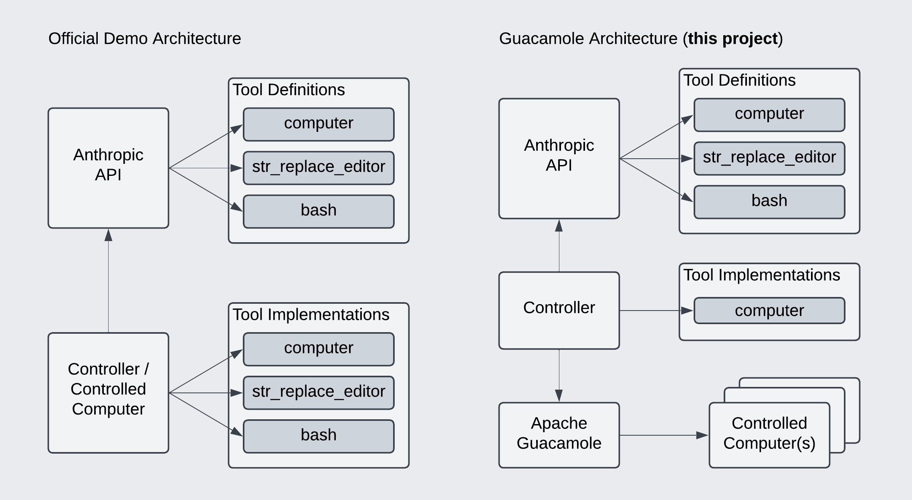

# 🚀 Anthropic Computer Use with Apache Guacamole

[](./LICENSE) [](#demo-video)

This project demonstrates how the **Anthropic Computer Use API** can be utilized with **Selenium** and **Apache Guacamole** to automate remote computer operations seamlessly. 🖥️✨

---

## 🎥 Demo Video

Experience the magic in action! Watch the full demo video here:

[](https://youtu.be/xkbIO4OmPhI)

---

## ✨ Why Use This Approach?

### Advantages:

- ✅ **No Configuration Needed** on controlled computers (just requires RDP).
- ✅ **Centralized Control**: Manage multiple computers from one machine.
- ✅ Enjoy **Apache Guacamole Features**, such as session recording.

### Disadvantages:

- ❌ Supports only the "computer" tool; shell commands aren't directly executable, unlike the official [Anthropic Computer Use Demo](https://github.com/anthropics/anthropic-quickstarts/tree/main/computer-use-demo).

### 📊 Architecture Comparison:

This diagram highlights the difference between this approach and the official demo:



---

## 🚀 How to Run the Demo

1. **Install Dependencies**:

   ```bash
   python3 -m venv venv
   source venv/bin/activate
   pip install -r src/requirements.txt
   ```

2. **Start the Demo**:

   ```bash
   ./run_demo.sh
   ```

3. **View the Session**:

   The output will provide a link to a Guacamole session where you can observe real-time computer control. 🎥

---

## 🤔 FAQ

### ❓ Is it possible to make the Guacamole session read-only?

Yes, you can adjust the `read-only` parameter in `connections/human.json`.

### ❓ How are the Guacamole connections made?

This demo uses the [Encrypted JSON authentication](https://guacamole.apache.org/doc/gug/json-auth.html) extension. The controller process takes the primary connection of the controlled computer, and the human can join in on this connection. See `connections/` for details.

### ❓ How is the controller acting on the remote computer?

The controller uses Selenium to interact with the Guacamole UI. Specifically, it dynamically executes JavaScript in the browser to send commands over WebSocket to the Guacamole session. These commands follow the [Guacamole protocol](https://guacamole.apache.org/doc/gug/guacamole-protocol.html). A translation layer in the code converts computer tool actions into Guacamole protocol commands.

### ❓ How much does it cost to run this?

It typically costs **$0.25 to $0.50 per minute**, as the computer use API sends a significant amount of image data to the LLM. Utilizing Anthropic's context caching features can help reduce these costs.

### ❓ Why is the resolution so small?

The [official Computer Use documentation](https://docs.anthropic.com/en/docs/build-with-claude/computer-use#computer-tool)
states that screenshots should not be above XGA/WXGA since otherwise the LLM API is
forced to resize the image to support LLM input constraints, which can lead to
lower model accuracy and slower performance. This demo is configured to use XGA, which
is 1024 x 768 pixels.

---

## 📜 License

This project is licensed under the [MIT License](./LICENSE). Feel free to use and modify the code, but **please attribute back to the original author** when using it in your own projects. 🙌

---

🌟 **Enjoy using this project! Feel free to contribute or reach out with questions.**
